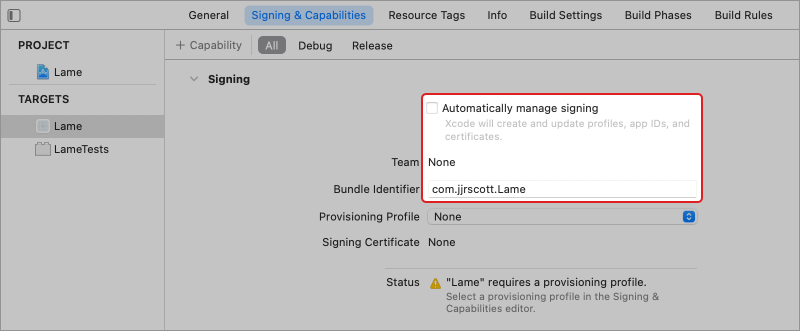

#  Lamé

Lamé is a simple example of an MVVM-C application written in Swift for iOS. It has **zero** external dependencies so should function fresh out of the box.

### Setup

This project builds against Xcode 12.5.1. If you wish to run this on a device you will need to:

1. update the bundle identifier of the app to something other than `com.jjrscott.Lame`
2. set the Team
3. enable Automatically manage signing



### The responder chain

Lame uses the responder chain to connect responders (e.g. `UIViewController`) with the coordinator which is itself a `UIResponder` (and `UIApplicationDelegate`). This functionality is implemented via `UIResponderDelegate` along with its associated default implementation

```swift
class SomeViewController: UITableViewController, UIResponderDelegate {
        
   weak var delegate: SomeViewControllerDelegate?
       
   override func tableView(_ tableView: UITableView, didSelectRowAt indexPath: IndexPath) {
      target?.selectItem(at: indexPath)
    }
}
```

If `delegate` is set, then it is used; otherwise, the view controller will search up the chain until it finds a responder that conforms to `SomeViewControllerDelegate`. In our example, the root `UIResponder` is `Coordinator`.

### Segues

Apple encourages the use of storyboards but keeping the flow out of view controllers is made almost impossible by the existence of `UIViewController.prepare(for:sender:)`.

However, back in the ObjC days, I used runtime magic and the knowledge that the whole process happens on the main thread to produce `performSegue(withIdentifier:prepare:)` which allows you to handle the preparation in the same code `performSegue` is called. In our case, the coordinator.

### AsyncCompletion

AsyncCompletion provides a simple mechanism to convert functions with a variaty of common completion handler types to their `async`/`await` equivalents.

For example, `withResultHandler` can be used to convert functions that have a [`Result`](https://developer.apple.com/documentation/swift/result) based completion handler:

```swift
func getFoo(..., completion: @escaping (Result<Foo,Error>)->Void)

@available(iOS 15.0.0, *)
func foo(...) async throws -> Foo {
   return try await withResultHandler { resultHandler in
      getFoo(page: pageIndex, result: resultHandler)
   }
}
```

While `withCompletionHandler` can be used to convert the other popular completion handler type:

```swift
func getFoo(..., completion: @escaping (Foo?, Error?)->Void)

@available(iOS 15.0.0, *)
func foo(...) async throws -> Foo {
   return try await withCompletionHandler { completionHandler in
      getFoo(..., completion: completionHandler)
   }
}
```

Very tidy.

### Storyboard constants

Runtime values like storyboard identifiers are dangerous, and unneccessary. `storyboard_constants` enables compile time connection to the internals of a storyboard. It achieves this by generating a Swift file containing constants for:

- segue identifiers
- storyboard identifiers
- table view cell reuse identifiers

If you remove a view from a storyboard and the constant will also be removed. Any code still using that constant will now fail to compile.

## Credits

### Gabriel Lamé

From [Wikipedia](https://en.wikipedia.org/wiki/Gabriel_Lam%C3%A9):

> **Gabriel Lamé** (22 July 1795 -- 1 May 1870) was a [French mathematician](https://en.wikipedia.org/wiki/Category:French_mathematicians "Category:French mathematicians") who contributed to the theory of [partial differential equations](https://en.wikipedia.org/wiki/Partial_differential_equation "Partial differential equation") by the use of [curvilinear coordinates](https://en.wikipedia.org/wiki/Curvilinear_coordinates "Curvilinear coordinates"), and the mathematical theory of [elasticity](https://en.wikipedia.org/wiki/Elasticity_(physics) "Elasticity (physics)") (for which [linear elasticity](https://en.wikipedia.org/wiki/Linear_elasticity "Linear elasticity") and [finite strain theory](https://en.wikipedia.org/wiki/Finite_strain_theory "Finite strain theory") elaborate the mathematical abstractions). 
>
> Lamé was born in [Tours](https://en.wikipedia.org/wiki/Tours "Tours"), in today's *département* of [Indre-et-Loire](https://en.wikipedia.org/wiki/Indre-et-Loire "Indre-et-Loire").
>
> He became well known for his general theory of [curvilinear coordinates](https://en.wikipedia.org/wiki/Curvilinear_coordinates "Curvilinear coordinates") and his notation and study of classes of ellipse-like curves, now known as [Lamé curves](https://en.wikipedia.org/wiki/Lam%C3%A9_curve "Lamé curve") or superellipses.

### App Icon

The app icon comes from a [collection of posters](https://whip-site.com/game-of-thrones) of the 6<sup>th</sup> season of the HBO series [Game of Thrones](https://en.wikipedia.org/wiki/Game_of_Thrones). For the record, I still think the final scene should have been [Night's King](https://en.wikipedia.org/wiki/Night_King) sat on the [Iron Throne](https://en.wikipedia.org/wiki/Iron_Throne_(A_Song_of_Ice_and_Fire)), breaking the [fourth wall](https://en.wikipedia.org/wiki/Fourth_wall).

The [`imageset_generator`](https://github.com/jjrscott/Sidekick/blob/master/imageset_generator) script used to generate all the different app icons sizes (18 at the last count) is part of another project called [Sidekick](https://github.com/jjrscott/Sidekick). Sidekick is a collection of scripts for Xcode based development, including 
